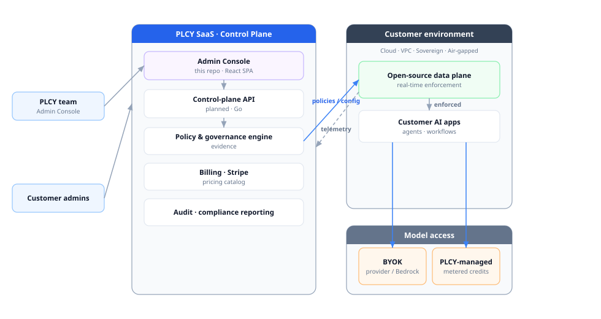
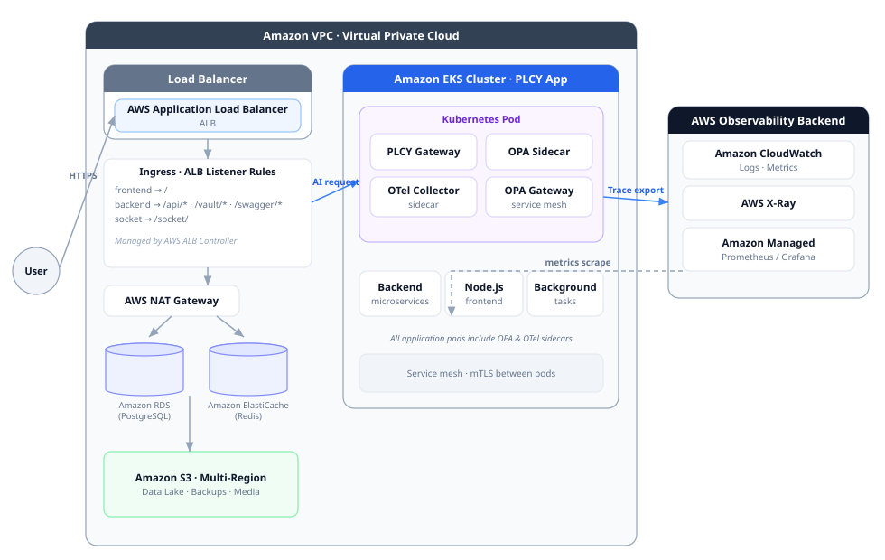
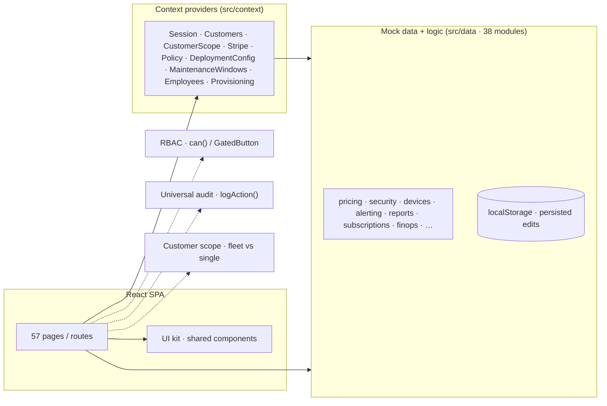

# PLCY — Admin Console

Internal console for the **PLCY** team to operate the **AI Governance & Policy
Enforcement Platform** across SaaS and air-gapped single-tenant customers. One
place to manage customers and their deployments, the models and policies under
governance, billing and pricing, security posture, incidents, compliance
reporting, and fleet operations.

> **Prototype note.** This repository is a **front-end prototype driven entirely
> by mock data** (`src/data/*`). There is no backend — Stripe, AWS/Bedrock,
> clusters, and audit are modeled faithfully for demos and design, but nothing
> bills a card or provisions infrastructure. Interactive edits persist to
> `localStorage`.

---

## Product context

PLCY enforces security, privacy, compliance, and human-oversight policies on
**every AI request in real time**. It pairs a **SaaS governance console** (this
kind of app) and control plane with an **open-source data plane** that runs
inside the customer's own cloud, VPC, sovereign infrastructure, or air-gapped
network. Model access is **BYOK by default** (the customer pays their provider /
AWS directly) with an optional **PLCY-managed** credits layer.

**Logical architecture** — the SaaS control plane, the customer-hosted data
plane, and model access:



**Network & deployment topology** — how the data plane runs inside a customer
AWS VPC (load balancing, EKS pods with OPA/OTel sidecars, data stores, and the
observability backend):



> These figures are also in the console under **Documentation → Technical**
> (Architecture overview · Network & deployment topology), rendered from the
> same source.

---

## The console (this repo)

A React SPA: **~28k LOC**, **57 pages / 59 routes**, **38 data modules**, **9
context providers**. State is held in React Context providers seeded from the
mock data modules; user edits persist to `localStorage`.



### Cross-cutting systems

- **RBAC** — capability-gated actions via `useSession().can(cap)` / `<GatedButton cap=…>`; an editable access matrix in Settings.
- **Universal audit** — every action logs through `logAction({ action, target, category })`.
- **Customer scope** — a fleet-vs-single-customer switcher (`useCustomerScope()`) that re-scopes reports and pages.
- **Live signal routing** — fleet, billing, and device signals flow into Notifications and page on-call.
- **Persistence** — security policy, device registry, pricing catalog, on-call, incidents, org settings, etc. survive reloads.

---

## Navigation map

| Group | Screens |
|---|---|
| **Overview** | Dashboard · Fleet Overview · **Reports** (8 generators) |
| **Customers** | Customers (drill-down + config change-requests) · Instances · **Pricing & Plans** · Billing & Usage · Billing Integration (Stripe) · Billing Health · Cost & Margin (FinOps) |
| **Fleet** | Provisioning · Bulk Operations · Releases · Update Bundles · Cluster Health · Fleet Posture · Backups & DR · Licensing |
| **Sovereignty** | Regions · Residency Controls · Data Transfers · Sub-processors · Model Routing · Data Requests (DSAR) |
| **Governance** | AI Models · Model Registry · Data Classification |
| **Policy** | Policy Packs (Control ⊂ Primitive ⊂ Composite) · Policy Editor · Enforcement Controls |
| **Operations** | Observability · Compliance Reporting · Incident Management · SLA & Maintenance · Risk Assessment |
| **Platform** | Team · Audit Log · Admin Security · Privileged Access · Supply Chain · Container Registry · Notifications · Developer Tools · Super Admin · Settings |

---

## Notable subsystems

- **Reports hub** (`/reports`) — 8 scope-aware generators (Fleet Posture, Compliance, Security, SLA & Credits, Cost & Margin, Incident Post-Mortem, DSAR Fulfilment, per-customer Account) on a shared `ReportShell` + download util, with CSV/Markdown/print export.
- **Pricing & Plans** (`/pricing`) — editable plans catalog (capacity + entitlements), add-ons with bulk packs, discount levers, throughput tiers, a Bedrock model catalog, and a live **quote builder** (dedicated cloud, cache-hit discount, BYOK vs managed, order-form + export). Reconciled to customers and Stripe MRR.
- **Security & device trust** (Settings → Security) — an org security-policy surface with a live **posture score**, plus **device enrollment** (hardware-bound Device ID, VPN + posture checks).
- **Notifications** — a **live signal-routing** engine (signals → rules → channels → on-call), with editable on-call, rotation, and escalation.

---

## Tech stack

- **React 18** + **TypeScript** (strict, `noUnusedLocals`)
- **Vite** — dev server & build
- **Tailwind CSS v3** — design system
- **React Router v6** — routing (HashRouter for the standalone preview)
- **Recharts** — charts · **lucide-react** — icons · **clsx** — class merging

No backend or other runtime dependencies.

## Getting started

```bash
npm install
npm run dev      # dev server (http://localhost:5173)
npm run build    # type-check + production build
npm run preview  # preview the production build
```

Ship checklist for a change: `npx tsc --noEmit` → `VITE_HASH_ROUTER=1 npx vite
build --base=./` → browser-verify → commit.

## Project structure

```
src/
  components/     # Layout, Sidebar, Topbar, ui kit, ReportShell, ManagedDevices, …
  config/         # navigation.ts (sidebar + route groups)
  context/        # 9 state providers (Session, Customers, Stripe, Policy, …)
  data/           # 38 mock-data + logic modules (pricing, security, alerting, …)
  pages/          # 57 route components
  App.tsx         # router (59 routes)
  main.tsx        # entry
```

## Design system

Shared primitives in `src/components/ui.tsx`; global classes (`.card`,
`.btn-primary`, `.input`, …) in `src/index.css`. Brand = the blue `brand-*`
scale; emerald = healthy, amber/orange = warning, rose = danger, slate =
neutral. Pages follow a RAG (red/amber/green) status language throughout.

## Roadmap

- **Backend** — a Go control-plane API + open-source data plane; migrate the console off mock data module-by-module.
- **Model/ML services** — Python for evaluation, guardrail classifiers, and RAG.
- **Deeper Stripe/AWS** — live billing and dedicated-cloud provisioning.
